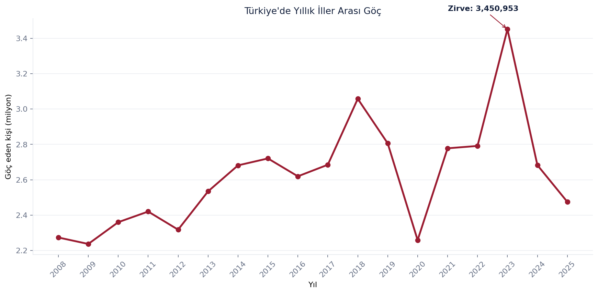
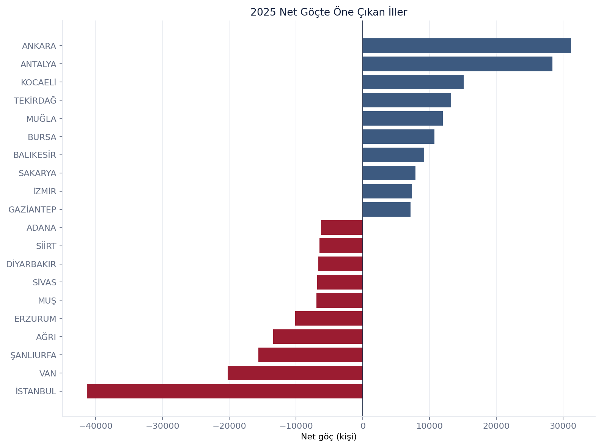
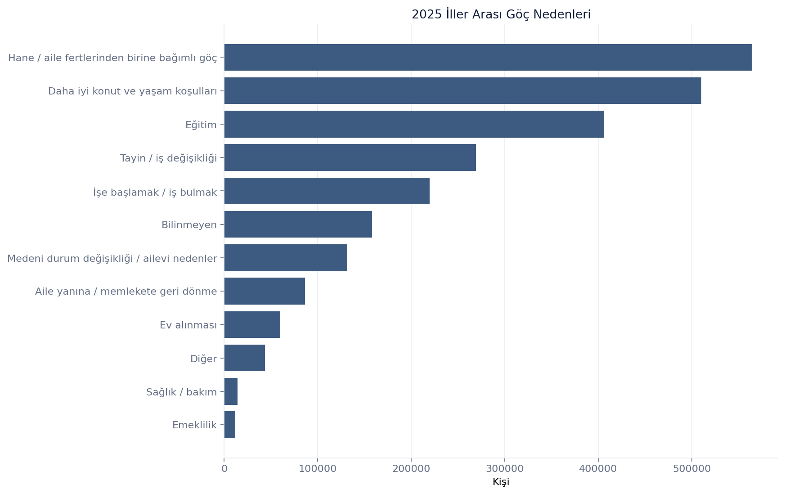
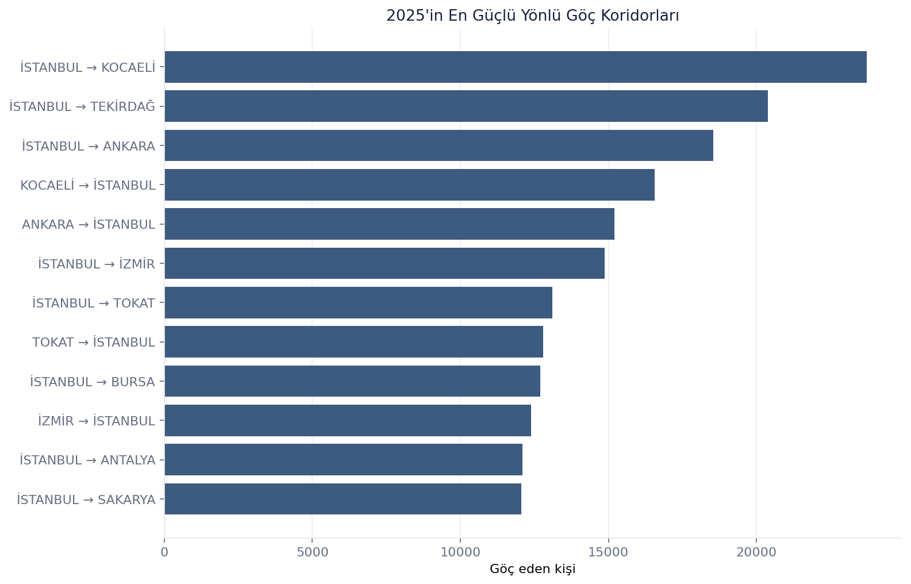
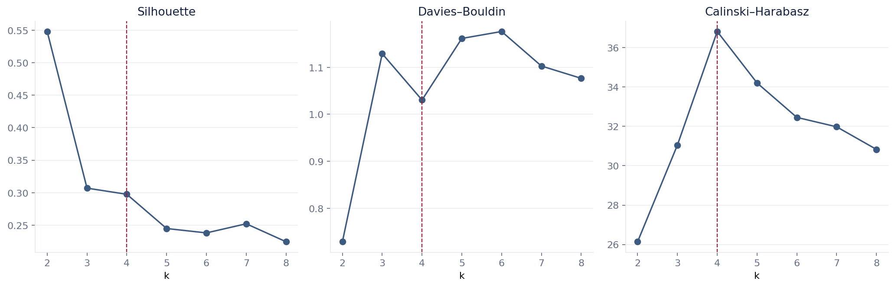
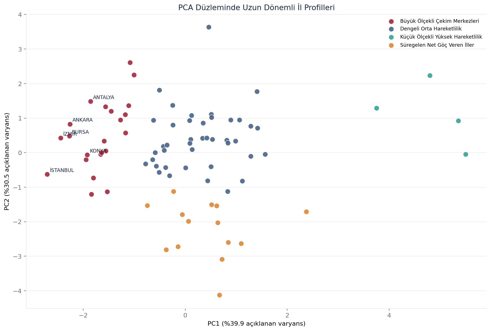

# Türkiye İç Göç Atlası — Analitik Rapor

## Executive Summary

Bu çalışma, TÜİK'in 2008–2025 dönemine ait **116.640** iller arası akış kaydını ve 2025 demografi tablolarını birleştirir. Yıllık toplam iller arası göç 2023'te **3.450.953** kişiyle zirveye ulaştı; 2025 toplamı **2.475.019** kişi ve bir önceki yıla göre değişim **%-7,7** oldu. Uzun dönemli özelliklerle eğitilen K-Means modeli, 81 ili yorumlanabilir dört göç profiline ayırdı.

## Problem Definition

Amaç, Türkiye'deki iller arası göçün hacmini, yönünü, demografik bileşimini ve uzun dönemli il profillerini tekrar üretilebilir bir veri bilimi hattıyla incelemektir. Clustering sonuçları nedensel veya ileriye dönük tahmin olarak değil, benzer göç davranışlarının betimleyici segmentasyonu olarak yorumlanır.

## Data Sources

- `iller_arasi_goc.xlsx`: 2008–2025, yıl × hedef il × kaynak il seviyesinde 116.640 kayıt.
- `illerin_goc_ozeti.xls`: 2025 için 81 ilin nüfus, giriş, çıkış, net göç ve net göç hızı.
- `yas_cinsiyet_goc.xls`: 2025 yaş grubu ve cinsiyet dağılımı.
- `yas_cinsiyet_neden.xls`: 2025 yaş, cinsiyet ve göç nedeni kırılımı.
- `egitim_goc_nedeni.xls`: 2025 eğitim durumu ve göç nedeni kırılımı (6+ yaş).

## Data Quality

Ham dosyalardaki Türkçe/İngilizce kaynak satırları, dipnotlar, toplam satırları ve açıklamalar processed katmandan çıkarıldı. Ana akış tablosunda her yıl için **81 × 80 = 6.480** kaynak–hedef çifti, sıfır self-loop, sıfır duplicate ve sıfır eksik değer doğrulandı. Negatif olamayacak alanlar, iki yönlü akış simetrisi ve `net = gelen - giden` eşitliği assertionlarla kontrol edildi. 2025 il agregasyonları resmi 81-il özetinin nüfus, gelen, giden, net ve TÜİK net göç hızıyla birebir uzlaştırıldı. `-` işaretleri sıfıra çevrilmedi; bilgi-yok değerleri `NaN` olarak korundu.

## Methodology

Bir satırdaki `migration_flow`, kaynak ilden hedef ile olan tekil yönlü akıştır. Ulusal toplamda yalnızca bu alan toplanarak aynı hareketin iki kez sayılması engellendi. İl düzeyinde gelen ve giden göç ayrı ayrı toplandı; hareketlilik bunların toplamı olarak tanımlandı. Net göç hızı TÜİK'in dönem ortası nüfus yaklaşımıyla hesaplandı.

## Exploratory Analysis

2023 zirvesinin ardından toplam hareket 2024 ve 2025'te geriledi. 2025'te en fazla göç alan ve veren il **İSTANBUL** oldu (sırasıyla 329.912 ve 371.258). Mutlak net göçte **ANKARA** +31.172 ile ilk, **İSTANBUL** -41.346 ile son sırada yer aldı. Nüfusa oranlı net göç hızında **YALOVA** ‰20,48, **AĞRI** ‰-26,99 kaydetti.

2025'te en kalabalık göç yaş grubu **20-24** (480.185 kişi) oldu. Toplamda 1.298.685 kadın ve 1.176.334 erkek iller arası göç etti. En yaygın kaydedilen neden **Hane / aile fertlerinden birine bağımlı göç** (564.114 kişi) oldu.

## Migration Network Analysis

Akışlar kaynak→hedef yönünde weighted directed graph olarak kuruldu. 2025'in en büyük yönlü koridoru **İSTANBUL → KOCAELİ** ve 23.723 kişiydi. Weighted PageRank'te **İSTANBUL** 0,119 ile ilk sırada yer aldı. Ağ yoğun olduğu için yorum gücü düşük betweenness metriği final analize eklenmedi.

## Feature Engineering

Model girdileri tek bir yıl yerine 2008–2025 davranışını temsil eder: ortalama hareketlilik hızı, ortalama net göç hızı, net hız volatilitesi, doğrusal trend, 2023–2025 yakın dönem ortalaması ve log-dönüşümlü 2025 nüfusu. Manuel deprem bayrağı veya bölge dummy'si kullanılmadı; bu sayede clustering coğrafi etiketlerle önceden zorlanmadı.

## Clustering Methodology

K-Means için `k=2…8` aralığında inertia, Silhouette, Davies–Bouldin, Calinski–Harabasz ve 10 farklı random seed arası Adjusted Rand Index kararlılığı hesaplandı. En az 3 il içeren ve tek kümede illerin %75'inden fazlasını toplamayan adaylar arasında metrik sıraları dengelendi.

## Model Comparison

HDBSCAN karşılaştırması **2 küme** ve **25 noise il** üretti; noise hariç Silhouette 0,303 oldu. Yeni gözlemlere kararlı profil atayabilen K-Means bu nedenle production modeli, HDBSCAN ise keşifsel sağlama olarak tutuldu.

## Final Model

Seçilen `k`: **4**. Final metrikler: Silhouette **0,298**, Davies–Bouldin **1,031**, Calinski–Harabasz **36,82**, seed stability ARI **0,993**. PCA'nın ilk iki bileşeni toplam varyansın **%70,5**'ini açıklar; PCA yalnızca boyut indirgeme ve görselleştirme için kullanıldı.

## Cluster Profiles

- **Küçük Ölçekli Yüksek Hareketlilik (4 il):** ortalama hareketlilik hızı ‰175,4, uzun dönem net göç hızı ‰0,5, son üç yıl ortalaması ‰2,0.
- **Dengeli Orta Hareketlilik (41 il):** ortalama hareketlilik hızı ‰86,8, uzun dönem net göç hızı ‰-0,9, son üç yıl ortalaması ‰2,7.
- **Büyük Ölçekli Çekim Merkezleri (22 il):** ortalama hareketlilik hızı ‰60,9, uzun dönem net göç hızı ‰3,4, son üç yıl ortalaması ‰3,9.
- **Süregelen Net Göç Veren İller (14 il):** ortalama hareketlilik hızı ‰78,6, uzun dönem net göç hızı ‰-13,3, son üç yıl ortalaması ‰-14,9.

## Key Findings

1. Yıllık iller arası göç 2023'te 3.450.953 kişiyle dönem zirvesine ulaştı.
2. 2025 toplamı 2024'e göre %7,7 azaldı.
3. İstanbul hem en yüksek giriş hem en yüksek çıkış hacmine sahipken net -41.346 kayıp verdi.
4. Ankara +31.172 kişiyle 2025'in en yüksek mutlak net kazancını kaydetti.
5. İstanbul→Kocaeli koridoru 2025'te 23.723 kişiyle en güçlü yönlü akış oldu.
6. 20–24 yaş grubu 480.185 kişiyle en hareketli yaş grubuydu.
7. Hane/aile ferdine bağımlı göç 564.114 kişiyle en yaygın kaydedilen nedendi.
8. Dört profilli K-Means sonucu farklı seed'ler karşısında yüksek kararlılık gösterdi (ARI 0,993).

## Limitations

- Yaş, cinsiyet, eğitim ve göç nedeni tabloları yalnızca 2025'i kapsar; bu boyutlarda uzun dönem trendi kurulamaz.
- Ham tablodaki `-` işareti bilgi-yok/magnitude-null anlamındadır; eksik değer olarak korunur ve ilgili toplamlar dikkatle yorumlanır.
- 81 il, clustering için küçük bir örneklemdir; içsel metrikler evrensel bir "doğru" segmentasyon garanti etmez.
- Cluster'lar nedensellik veya gelecek tahmini sunmaz.
- İstihdam, gelir, konut maliyeti ve afet etkisi gibi dış açıklayıcı değişkenler modelde yoktur.

## Future Work

Ekonomik ve mekânsal değişkenlerin kaynaklı biçimde eklenmesi, profile stability için bootstrap güven aralıkları, göç koridorlarının coğrafi harita üzerinde gösterimi ve yeni TÜİK yılları geldiğinde veri/model sürümleme adımları sonraki geliştirmelerdir.

## Deployment

Model preprocessing + K-Means adımları tek `joblib` pipeline olarak, PCA ayrı bir pipeline olarak ve profil tanımları JSON metadata olarak saklanır. Streamlit uygulaması bu artefact'ları cache ile diskten yükler; açılışta model eğitmez.
